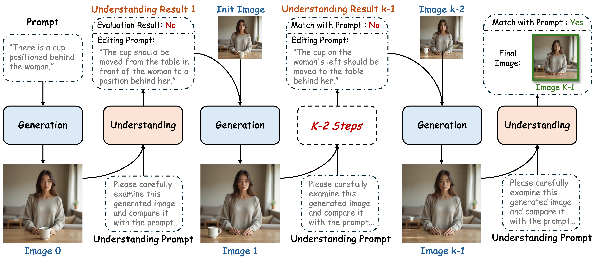

# Understanding-in-Generation: Reinforcing Generative Capability of Unified Model via Infusing Understanding into Generation

[](https://arxiv.org/pdf/2509.18639)

[Yuanhuiyi Lyu](https://qc-ly.github.io/)<sup>1</sup>,
[Chi-Kit Wong]()<sup>1</sup>,
[Chenfei Liao](https://chenfei-liao.github.io/)<sup>1</sup>,
[Lutao Jiang](https://lutao2021.github.io/)<sup>1</sup>,
[Xu Zheng](https://zhengxujosh.github.io/)<sup>1</sup>,
[Zexin Lu]()<sup>4</sup>,
[Linfeng Zhang](http://www.zhanglinfeng.tech/)<sup>2</sup>,
[Xuming Hu](https://xuminghu.github.io/)<sup>4</sup>,


<span class="author-block"><sup>1</sup>The Hong Kong University of Science and Technology (Guangzhou)</span> \
<span class="author-block"><sup>2</sup>Shanghai Jiao Tong University</span> \
<span class="author-block"><sup>3</sup>The Hong Kong University of Science and Technology</span> \
<span class="author-block"><sup>4</sup>Huawei Hong Kong Research Center</span><br>



## Requirements

* Clone the repository:
   ```
   git clone https://github.com/qc-ly/UiG

   cd UiG
   ```
* Create an environment:
   ```
   conda create -n UiG python==3.10 -y

   conda activate UiG
   ```
* Install the required packages:
   ```
   pip install -r requirements.txt

   pip install flash_attn==2.5.8 --no-build-isolation
   ```

## Inference

1. Please follow [official instruction](https://github.com/ByteDance-Seed/Bagel) to download the `BAGEL-7B-MoT` checkpoint and save the checkpoint to `./ckpts`.

2. Generate images from the prompts in `./prompts/test_prompt.txt`:

    ```shell
    bash scripts/infer.sh
    ```
    for slurm:

    ```shell
    bash scripts/infer_slurm.sh
    ```

3. Generate images from input prompts:

    ```shell
    python infer.py --prompt_text "A larger person in yellow clothing is partially hidden by a smaller person in a different color."
    ```

## Evaluation

We follow the official settings of [TIIF-Bench](https://github.com/A113N-W3I/TIIF-Bench) and [WISE-Bench](https://github.com/PKU-YuanGroup/WISE) to evaluate UiG.

The evaluation results are provided in [Google Drive](https://drive.google.com/drive/folders/1dv3gXB879yZKvZeyF18YPpgs-4qPfdzu?usp=drive_link)


## Acknowledgement

Our codes are built on open-source codes, thanks to the following projects:

* [BAGEL](https://github.com/ByteDance-Seed/Bagel)
* [T2I-R1](https://github.com/CaraJ7/T2I-R1)
* [ReasonGen-R1](https://github.com/Franklin-Zhang0/ReasonGen-R1)
* [Image-CoT](https://github.com/ZiyuGuo99/Image-Generation-CoT)
* [WISE-Bench](https://github.com/PKU-YuanGroup/WISE)
* [TIIF-Bench](https://github.com/A113N-W3I/TIIF-Bench)

Thanks for their outstanding works and open-source!

## Citation

If you find this repository useful, please consider giving stars ⭐ and citations

```
@article{lyu2025understanding,
  title={Understanding-in-Generation: Reinforcing Generative Capability of Unified Model via Infusing Understanding into Generation},
  author={Lyu, Yuanhuiyi and Wong, Chi Kit and Liao, Chenfei and Jiang, Lutao and Zheng, Xu and Lu, Zexin and Zhang, Linfeng and Hu, Xuming},
  journal={arXiv preprint arXiv:2509.18639},
  year={2025}
}
```

## Contact

If you have questions, suggestions, and bug reports, please email:
```
ryan.lyu.mail@gmail.com
```
